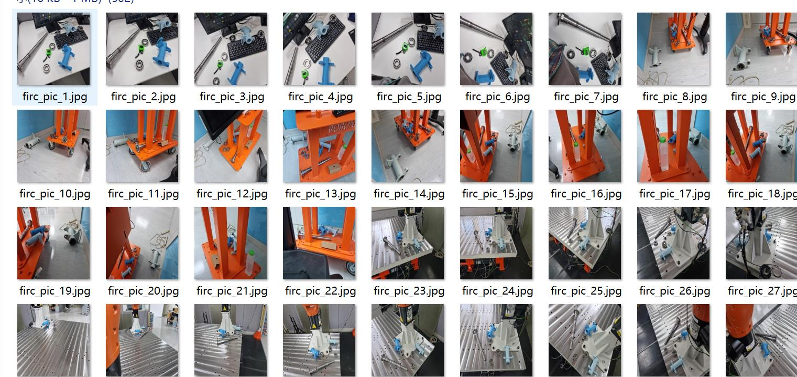
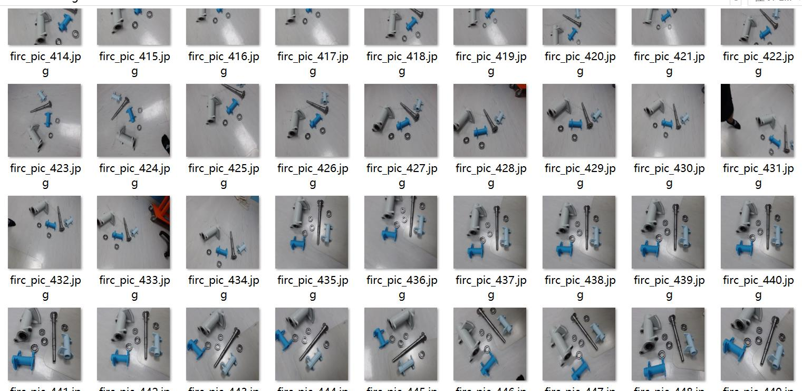
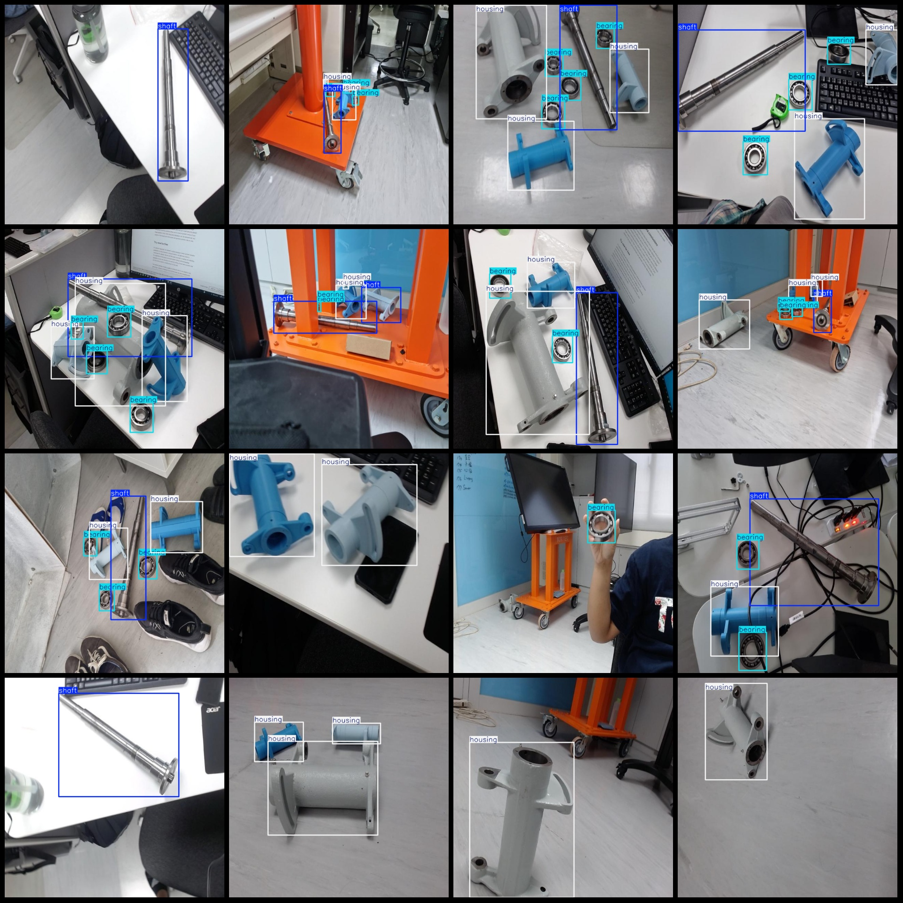
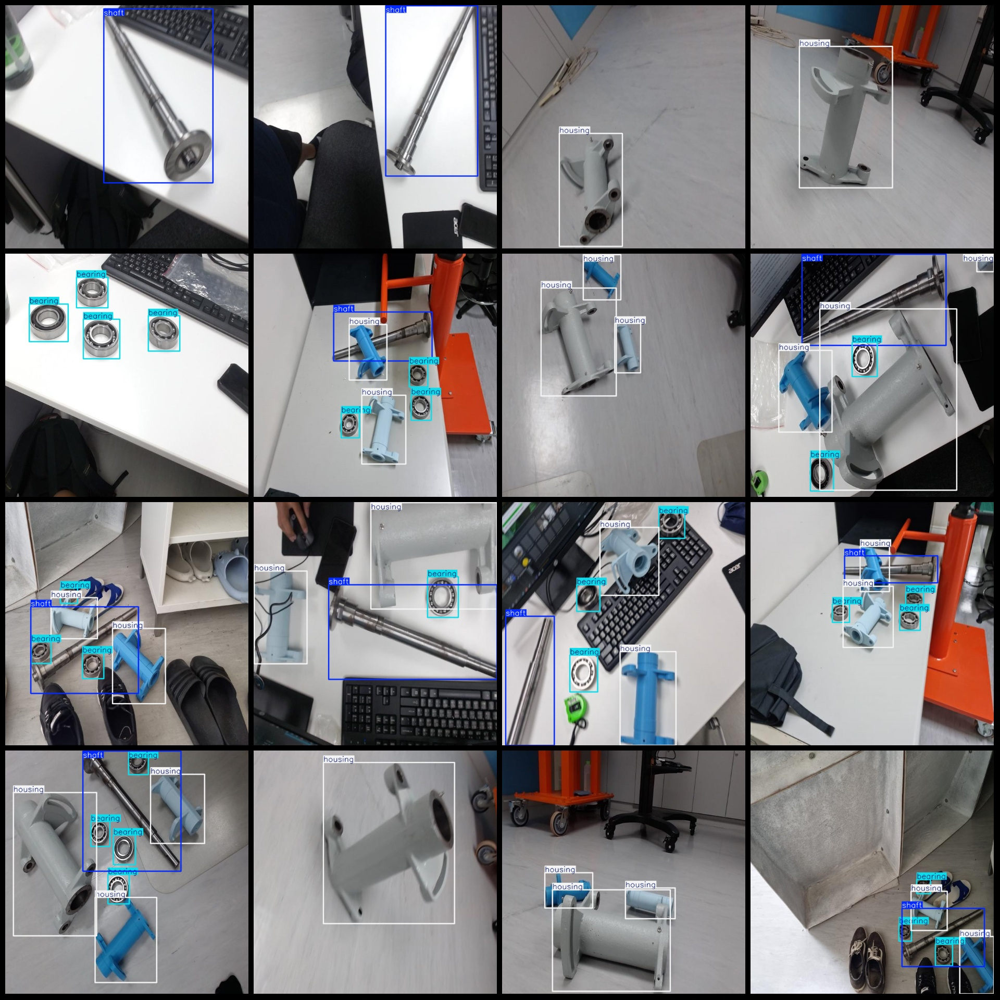

# Bearing Shell Axis Detection Dataset VOC+YOLO format with 510 images in 3 categories

Dataset format: Pascal VOC format + YOLO format (without split path in txt file, only containing jpg images and corresponding VOC format xml files and yolo format txt files)

Number of images (jpg file count): 510
Number of annotations (xml file count): 510
Number of annotations (txt file count): 510
Number of categories: 3
Label names for annotations (note that the order of categories in the yolo format does not correspond with this, but is based on the labels folder's classes.txt): ["bearing", "housing", "shaft"]

Each category has a number of bounding boxes:
- Bearing : 921 bounding boxes
- Housing : 850 bounding boxes
- Shaft : 351 bounding boxes
Total bounding boxes: 2122

Each category occupies a number of images:
- Bearing : 346 images occupied
- Housing : 392 images occupied
- Shaft : 347 images occupied

Image resolution: 640x640

Annotation tool used: labelImg
Annotation rules: draw rectangle bounding boxes for each category

Important note: The dataset does not have been divided into training, validation, or test sets, so it needs to be manually divided.

Special declaration: This dataset does not guarantee the accuracy of the trained model or weight files.

Image preview:

Annotation example:
## Images

Here is a pay link on Stripe ( https://buy.stripe.com/3cs8yP7sY87d0vu9AB ). Please contact me lonlonago@foxmail.com after funding $89, and I will send you a complete data files , thank you!

